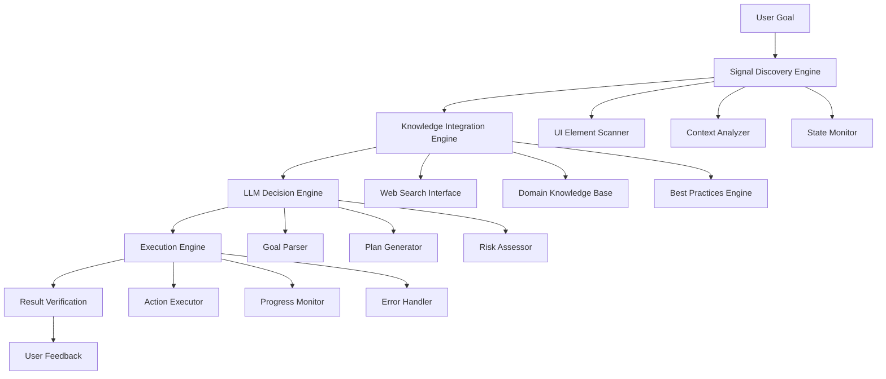

# Intelligent UI Automation Architecture

## Overview

This architecture enables an LLM to make informed decisions about UI automation by combining real-time UI element discovery, web search for context, and intelligent planning. The system presents all available signals to the LLM, allowing it to construct optimal automation plans based on current state, user goals, and external knowledge.

## Core Components

### 1. Signal Discovery Engine (`SignalCollector`)

**Purpose**: Discovers and presents all available UI signals to the LLM

**Components**:
- **UI Element Scanner**: Uses accessibility APIs to discover all interactive elements
- **Context Analyzer**: Analyzes current application state, window titles, focused elements
- **Capability Detector**: Identifies available actions (click, type, select, etc.)
- **State Monitor**: Tracks current system state (battery, network, time, etc.)

**Output**: Structured signal map with all available options

```python
{
    "ui_elements": [
        {
            "id": "low_power_mode",
            "type": "popup_button", 
            "position": (1343, 86),
            "current_value": "Never",
            "available_options": ["Never", "Always", "Only on Battery"],
            "action": "click_to_open_dropdown"
        }
    ],
    "system_state": {
        "battery_level": 42,
        "power_source": "battery",
        "time": "14:30",
        "network_status": "connected"
    },
    "context": {
        "current_app": "System Settings",
        "current_pane": "Battery",
        "focused_element": "low_power_mode"
    }
}
```

### 2. Knowledge Integration Engine (`KnowledgeIntegrator`)

**Purpose**: Provides external context and domain knowledge to the LLM

**Components**:
- **Web Search Interface**: Searches for relevant information about the task
- **Domain Knowledge Base**: Pre-built knowledge about common automation tasks
- **Best Practices Engine**: Provides recommendations based on system behavior
- **Contextual Information**: Gathers relevant system information

**Example Web Searches**:
- "macOS low power mode best practices battery life"
- "System Settings automation accessibility APIs"
- "Power management optimization techniques"

### 3. LLM Decision Engine (`LLMPlanner`)

**Purpose**: Processes all signals and creates intelligent automation plans

**Components**:
- **Goal Parser**: Understands user intent and objectives
- **Plan Generator**: Creates step-by-step automation sequences
- **Risk Assessor**: Evaluates potential issues and side effects
- **Optimization Engine**: Finds most efficient paths

**Input Processing**:
1. Receives complete signal map from SignalCollector
2. Integrates web search results and domain knowledge
3. Analyzes user goal and constraints
4. Generates multiple plan options
5. Selects optimal plan with reasoning

### 4. Execution Engine (`AutomationExecutor`)

**Purpose**: Executes the LLM-generated plans with monitoring and error handling

**Components**:
- **Action Executor**: Performs UI interactions (clicks, typing, selections)
- **Progress Monitor**: Tracks execution and detects deviations
- **Error Handler**: Manages failures and provides recovery options
- **Verification Engine**: Confirms successful completion

## Architecture Flow



## Detailed Component Specifications

### Signal Discovery Engine

```python
class SignalCollector:
    def discover_ui_signals(self, target_app=None):
        """Discover all available UI elements and their capabilities"""
        return {
            "interactive_elements": self.scan_interactive_elements(),
            "system_state": self.get_system_state(),
            "application_context": self.get_app_context(),
            "available_actions": self.identify_actions(),
            "constraints": self.identify_constraints()
        }
    
    def scan_interactive_elements(self):
        """Find all clickable, typeable, selectable elements"""
        elements = []
        for element in self.get_all_ui_elements():
            if self.is_interactive(element):
                elements.append({
                    "id": element.get_identifier(),
                    "type": element.get_role(),
                    "position": element.get_position(),
                    "current_value": element.get_value(),
                    "available_options": element.get_options(),
                    "actions": element.get_available_actions()
                })
        return elements
```

### Knowledge Integration Engine

```python
class KnowledgeIntegrator:
    def gather_context(self, user_goal, current_signals):
        """Gather relevant knowledge for the task"""
        return {
            "web_search_results": self.search_web(user_goal),
            "domain_knowledge": self.get_domain_knowledge(user_goal),
            "best_practices": self.get_best_practices(user_goal),
            "system_recommendations": self.get_system_recommendations()
        }
    
    def search_web(self, query):
        """Search for relevant information"""
        searches = [
            f"{query} best practices",
            f"{query} automation techniques",
            f"{query} common issues",
            f"{query} optimization tips"
        ]
        return [self.perform_search(s) for s in searches]
```

### LLM Decision Engine

```python
class LLMPlanner:
    def create_automation_plan(self, signals, knowledge, user_goal):
        """Generate intelligent automation plan"""
        prompt = self.build_decision_prompt(signals, knowledge, user_goal)
        
        return {
            "plan": self.llm.generate_plan(prompt),
            "reasoning": self.llm.get_reasoning(),
            "alternatives": self.llm.get_alternatives(),
            "risks": self.llm.assess_risks(),
            "confidence": self.llm.get_confidence()
        }
    
    def build_decision_prompt(self, signals, knowledge, goal):
        """Build comprehensive prompt for LLM decision making"""
        return f"""
        GOAL: {goal}
        
        AVAILABLE UI ELEMENTS:
        {self.format_ui_elements(signals['interactive_elements'])}
        
        SYSTEM STATE:
        {self.format_system_state(signals['system_state'])}
        
        EXTERNAL KNOWLEDGE:
        {self.format_knowledge(knowledge)}
        
        TASK: Create an optimal automation plan that achieves the goal using available elements.
        Consider system state, best practices, and potential risks.
        """
```

## Example Use Cases

### 1. Power Management Automation

**User Goal**: "Optimize battery life"

**Signals Discovered**:
- Low Power Mode toggle (Never/Always/Only on Battery)
- Battery level (42%)
- Power source (battery)
- Screen brightness controls
- Background app refresh settings

**Web Knowledge**:
- "macOS battery optimization best practices"
- "Low power mode vs manual optimization"
- "Background app refresh impact on battery"

**LLM Decision**:
- Enable Low Power Mode (Only on Battery)
- Reduce screen brightness
- Disable unnecessary background refresh
- Set optimal power management

### 2. System Security Configuration

**User Goal**: "Enhance system security"

**Signals Discovered**:
- Firewall settings
- FileVault encryption status
- Touch ID settings
- Password requirements
- Two-factor authentication options

**Web Knowledge**:
- "macOS security best practices 2024"
- "FileVault encryption performance impact"
- "Touch ID security considerations"

**LLM Decision**:
- Enable FileVault if not already enabled
- Configure strong password requirements
- Enable two-factor authentication
- Review firewall settings

### 3. Accessibility Setup

**User Goal**: "Improve accessibility for visual impairment"

**Signals Discovered**:
- VoiceOver settings
- Display contrast options
- Text size controls
- Zoom functionality
- High contrast mode

**Web Knowledge**:
- "macOS accessibility features for visual impairment"
- "VoiceOver configuration best practices"
- "Display accessibility optimization"

**LLM Decision**:
- Enable VoiceOver with optimal settings
- Increase text size
- Enable high contrast mode
- Configure zoom shortcuts

## Implementation Strategy

### Phase 1: Core Infrastructure
- Implement SignalCollector with UI element discovery
- Create basic LLMPlanner with decision making
- Build simple AutomationExecutor

### Phase 2: Knowledge Integration
- Add web search capabilities
- Implement domain knowledge base
- Create best practices engine

### Phase 3: Advanced Features
- Add risk assessment and mitigation
- Implement plan optimization
- Create user feedback loop

### Phase 4: Intelligence Enhancement
- Add learning from user feedback
- Implement adaptive planning
- Create predictive capabilities

## Technical Requirements

### Dependencies
- **UI Automation**: `atomacos`, `ApplicationServices`
- **Web Search**: `requests`, `beautifulsoup4`
- **LLM Integration**: `openai`, `anthropic`, or local models
- **System Monitoring**: `psutil`, `pyobjc`

### Performance Considerations
- **Signal Discovery**: < 2 seconds for complete UI scan
- **Web Search**: < 5 seconds for knowledge gathering
- **LLM Processing**: < 10 seconds for plan generation
- **Execution**: Real-time with progress monitoring

### Error Handling
- **Graceful Degradation**: Continue with partial information
- **Recovery Mechanisms**: Retry failed actions
- **User Notification**: Clear error messages and alternatives
- **Logging**: Comprehensive execution logs

## Security Considerations

### Privacy Protection
- **Local Processing**: Sensitive data stays on device
- **Minimal Web Queries**: Only essential information searched
- **Data Encryption**: Secure storage of automation plans
- **User Consent**: Clear permission requests

### Safety Measures
- **Action Validation**: Confirm dangerous operations
- **Rollback Capability**: Undo automation changes
- **Rate Limiting**: Prevent system overload
- **Sandboxing**: Isolate automation processes

## Future Enhancements

### Advanced AI Features
- **Predictive Automation**: Anticipate user needs
- **Learning System**: Improve from user interactions
- **Natural Language Interface**: Voice command automation
- **Multi-Modal Input**: Combine voice, gesture, and text

### Integration Capabilities
- **Cross-Platform**: Extend to Windows, Linux
- **Cloud Integration**: Sync automation across devices
- **API Access**: Third-party automation integration
- **Workflow Orchestration**: Complex multi-step automations

This architecture provides a foundation for intelligent, context-aware UI automation that can adapt to user needs and system conditions while maintaining security and privacy.
